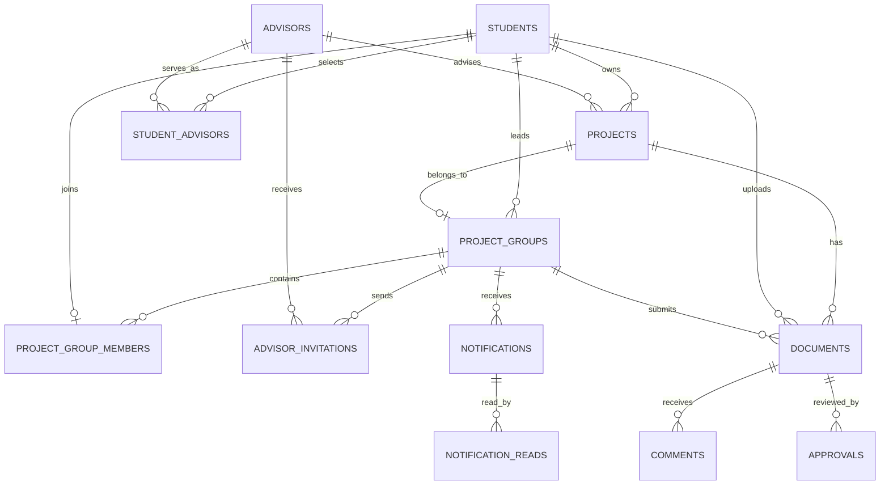

# RMUTP Senior Project Management System

ระบบจัดการโครงงานนักศึกษา RMUTP สำหรับผู้ดูแลระบบ อาจารย์ และนักศึกษา ครอบคลุมตั้งแต่การสร้างโครงงาน การจัดกลุ่ม การเชิญคณะกรรมการ การส่งและพิจารณาเอกสาร ไปจนถึงการเผยแพร่ฉบับสมบูรณ์

## ความสามารถหลัก

### ผู้ดูแลระบบ

- จัดการนักศึกษา อาจารย์ โครงงาน เอกสาร และการตั้งค่าระบบ
- ตรวจสอบสถานะ ความคืบหน้า รายงาน การแจ้งเตือน และ Audit log
- เปลี่ยนสถานะโครงงานเป็นเสร็จสมบูรณ์เมื่อผ่านเงื่อนไข

### นักศึกษา

- ทำโครงงานเดี่ยวหรือสร้างกลุ่มได้สูงสุด 5 คน
- หัวหน้ากลุ่มเพิ่มสมาชิก โอนสิทธิ์หัวหน้ากลุ่ม และส่งเอกสารแทนกลุ่ม
- เชิญอาจารย์เป็นประธาน รองประธาน และกรรมการ
- ส่ง Proposal, Draft บทที่ 1-5 และ Complete ตามลำดับ
- ดูสถานะ ผลพิจารณา รายละเอียดที่ต้องแก้ไข ไทม์ไลน์ ข้อความ และการแจ้งเตือน
- เปลี่ยนรหัสผ่านได้จากหน้าโปรไฟล์ โดยต้องยืนยันรหัสเดิมและใช้รหัสใหม่อย่างน้อย 8 ตัวอักษร

### อาจารย์

- รับหรือปฏิเสธคำเชิญจากนักศึกษา
- เห็นเฉพาะนักศึกษาและกลุ่มที่ตนรับผิดชอบ
- พิจารณาเอกสารเป็นอนุมัติ ส่งกลับมาแก้ไข หรือไม่อนุมัติ
- ดูและดาวน์โหลดเอกสารที่อนุมัติแล้ว โดยไม่สามารถเปลี่ยนผลเดิม
- ส่งข้อความและสร้างนัดหมายให้กลุ่มนักศึกษา

## ลำดับการทำโครงงาน

1. นักศึกษาสร้างโครงงานเดี่ยวหรือกลุ่มโครงงาน
2. กลุ่มมีสมาชิกได้ไม่เกิน 5 คน และผู้สร้างเป็นหัวหน้ากลุ่ม
3. หัวหน้ากลุ่มส่งคำเชิญให้อาจารย์ โดยเลือกทีละตำแหน่งได้
4. ต้องมีประธานตอบรับแล้วจึงเริ่มส่งเอกสารได้
5. ส่ง Proposal และรออนุมัติ
6. เมื่อ Proposal ผ่าน จึงส่ง Draft บทที่ 1 ได้
7. Draft ต้องส่งและผ่านตามลำดับบทที่ 1 ถึง 5
8. เมื่อ Draft ผ่านครบทั้ง 5 บท จึงส่ง Complete ได้
9. เมื่อ Complete ผ่าน โครงงานจึงเปลี่ยนเป็นเสร็จสมบูรณ์และสร้างบาร์โค้ดได้

เอกสารที่ถูกส่งกลับมาแก้ไขหรือไม่อนุมัติจะแสดงสถานะและรายละเอียดจากอาจารย์ ก่อนให้นักศึกษาส่งฉบับใหม่

## กฎของกลุ่มและคณะกรรมการ

- โครงงานเดี่ยวไม่ต้องสร้างกลุ่ม และไม่สามารถเพิ่มสมาชิกภายหลัง
- การส่งเอกสารของกลุ่มทำได้โดยหัวหน้ากลุ่มเท่านั้น
- คณะกรรมการมี 3 ตำแหน่ง: ประธาน รองประธาน และกรรมการ
- อาจารย์ต้องมีคณะและสาขาตรงกับนักศึกษา
- อาจารย์คนเดียวกันไม่สามารถอยู่มากกว่าหนึ่งตำแหน่งในโครงงานเดียวกัน
- เมื่อตอบรับตำแหน่งแล้ว ตำแหน่งนั้นจะถูกล็อกให้สมาชิกทุกคนในกลุ่ม
- ระบบไม่จำกัดจำนวนกลุ่มโครงงานที่อาจารย์รับผิดชอบ

## คลังโครงงานและ Watermark

หน้า `login.php` แสดงคลังโครงงานฉบับสมบูรณ์จากใหม่ไปเก่า หน้าละ 5 รายการ ผู้ใช้ทั่วไปและอาจารย์สามารถค้นหาและดาวน์โหลดได้

Watermark ใช้เฉพาะการดาวน์โหลดเอกสาร `Complete` ที่ผ่านอนุมัติแล้ว:

- Proposal, Draft และ Preview ไม่มี Watermark
- ไม่แก้ไขหรือเขียนทับไฟล์ต้นฉบับใน `uploads/complete`
- ระบบสร้าง PDF ชั่วคราว ใส่ Watermark สีเทาอ่อนกึ่งกลางหน้า แล้วลบหลังส่งไฟล์
- Watermark สามารถประกอบด้วยชื่อผู้ดาวน์โหลด User ID วันเวลา และ Document ID

## ความต้องการของระบบ

- PHP 8.0 ขึ้นไป
- MariaDB/MySQL ผ่าน PDO
- Apache แนะนำให้ใช้ XAMPP บน Windows
- PHP extensions: `pdo_mysql`, `fileinfo`, `mbstring`, `openssl`
- Browser รุ่นปัจจุบันที่รองรับ JavaScript

## การติดตั้ง

แนะนำให้วางโปรเจกต์ไว้ที่:

```text
C:\xampp\htdocs\RMUTP-SeniorProject
```

1. เปิด XAMPP Control Panel และ Start `Apache` กับ `MySQL`
2. เปิด PowerShell หรือ Command Prompt ที่โฟลเดอร์โปรเจกต์
3. เรียกตัวติดตั้ง:

```bat
.\install.bat
```

ถ้าไม่ต้องการให้รอกดปุ่มเมื่อเสร็จ:

```bat
.\install.bat --no-pause
```

เมื่อติดตั้งสำเร็จจะแสดง `INSTALL SUCCESS` ตัวติดตั้งจะตรวจ PHP, extensions, MySQL, `.env`, Schema, โฟลเดอร์อัปโหลด และเงื่อนไขข้อมูลสำคัญ โดยรักษาข้อมูลเดิมเมื่อพบฐานข้อมูลที่ใช้งานอยู่

## การเปิดระบบ

```bat
.\run.bat
```

หรือเปิด URL โดยตรง:

```text
http://localhost/RMUTP-SeniorProject/login.php
```

ห้ามเปิดเป็น `login.php/` โดยไม่มี `localhost` เพราะ Browser จะตีความเป็นชื่อโดเมน

## บัญชีผู้ดูแลระบบเริ่มต้น

```text
Email: admin@rmutp.ac.th
Password: admin123
```

ควรเปลี่ยนรหัสผ่านก่อนนำระบบไปใช้งานจริง

## ขั้นตอนเริ่มใช้งานครั้งแรก

ทำตามลำดับนี้หลังนำโปรเจกต์ไปวางบนเครื่องใหม่:

1. เปิด XAMPP Control Panel แล้ว Start `Apache` และ `MySQL`
2. เปิด PowerShell ที่โฟลเดอร์ `C:\xampp\htdocs\RMUTP-SeniorProject`
3. รัน `.\install.bat` เพื่อสร้าง `.env`, ฐานข้อมูล, ตาราง และโฟลเดอร์อัปโหลด
4. ตรวจว่าหน้าจอแสดง `INSTALL SUCCESS`
5. รัน `.\run.bat` หรือเปิด `http://localhost/RMUTP-SeniorProject/login.php`
6. เข้าสู่ระบบด้วยบัญชีผู้ดูแลระบบเริ่มต้น
7. ไปที่เมนูตั้งค่าและตรวจปีการศึกษา ภาคการศึกษา กำหนดส่ง และเขตเวลา
8. เพิ่มข้อมูลอาจารย์ โดยระบุคณะและสาขาให้ถูกต้อง
9. เพิ่มข้อมูลนักศึกษา โดยระบุคณะและสาขาให้ตรงกับอาจารย์ที่สามารถเลือกได้
10. ทดลองเข้าสู่ระบบแต่ละบทบาทและตรวจหน้า Dashboard ก่อนเริ่มใช้งานจริง

หากเครื่องมีไฟล์ `.env` และฐานข้อมูลเดิมอยู่แล้ว ตัวติดตั้งจะรักษาค่าตั้งค่าและข้อมูลเดิม ไม่ควรลบฐานข้อมูลหรือไฟล์ใน `C:\xampp\mysql\data` ด้วยตนเอง

## ขั้นตอนการใช้งานตามบทบาท

### 1. ผู้ดูแลระบบเตรียมข้อมูล

1. เข้าสู่ระบบที่หน้า `login.php`
2. เพิ่มอาจารย์และกำหนดคณะ/สาขา
3. เพิ่มนักศึกษาและตรวจรหัสนักศึกษา อีเมล คณะ และสาขา
4. ตรวจการตั้งค่าปีการศึกษา ภาคการศึกษา และประกาศระบบ
5. ตรวจรายการโครงงาน เอกสาร รายงาน และ Audit log ระหว่างการใช้งาน

### 2. นักศึกษาสร้างโครงงาน

1. เข้าสู่ระบบด้วยอีเมลหรือรหัสนักศึกษา
2. เปิดหน้า `โครงงานของฉัน` แล้วเลือกทำโครงงานเดี่ยวหรือแบบกลุ่ม
3. ถ้าเป็นกลุ่ม ให้หัวหน้ากลุ่มเชิญสมาชิก โดยรวมแล้วไม่เกิน 5 คน
4. หัวหน้ากลุ่มเลือกอาจารย์ตำแหน่งประธาน รองประธาน และกรรมการ โดยเลือกทีละตำแหน่งได้
5. ส่งคำเชิญและรออย่างน้อยประธานตอบรับก่อนส่งเอกสาร
6. ส่ง Proposal และติดตามผลพิจารณา
7. เมื่อ Proposal ผ่าน ให้ส่ง Draft บทที่ 1-5 ตามลำดับ โดยต้องผ่านบทก่อนหน้าก่อน
8. เมื่อ Draft ผ่านครบทุกบท ให้ส่ง Complete
9. เมื่อ Complete ผ่าน ระบบจะเปลี่ยนโครงงานเป็นเสร็จสมบูรณ์และอนุญาตให้สร้างบาร์โค้ด

สำหรับโครงงานกลุ่ม การเพิ่มสมาชิก การเลือกคณะกรรมการ และการส่งเอกสารทำโดยหัวหน้ากลุ่ม สมาชิกคนอื่นสามารถติดตามข้อมูลของกลุ่มได้

### 3. อาจารย์พิจารณาโครงงาน

1. เข้าสู่ระบบจากหน้า `login.php`
2. เปิดการแจ้งเตือนและตอบรับหรือปฏิเสธคำเชิญตำแหน่งคณะกรรมการ
3. หลังตอบรับ จะเห็นเฉพาะนักศึกษาและกลุ่มที่ตนรับผิดชอบ
4. ตรวจ Proposal ก่อน หากยังไม่ผ่าน นักศึกษาจะยังส่ง Draft ไม่ได้
5. ตรวจ Draft ตามลำดับบทที่ 1-5
6. เลือกผลเป็น `อนุมัติ`, `ส่งกลับมาแก้ไข` หรือ `ไม่อนุมัติ` พร้อมใส่รายละเอียดเมื่อจำเป็น
7. เอกสารที่อนุมัติแล้วจะดูและดาวน์โหลดได้เท่านั้น ไม่สามารถเปลี่ยนผลพิจารณาเดิม
8. เมื่อตรวจ Complete ผ่านแล้ว ให้ตรวจสถานะโครงงานและรายการในคลังโครงงานสาธารณะ

### 4. ตรวจผลหลังจบโครงงาน

1. ตรวจว่า Complete มีสถานะอนุมัติแล้ว
2. ตรวจว่าโครงงานมีสถานะเสร็จสมบูรณ์และความคืบหน้า 100%
3. ตรวจว่าปุ่มสร้างบาร์โค้ดใช้งานได้
4. ออกจากระบบแล้วเปิดหน้า `login.php`
5. ตรวจว่าผลงานปรากฏในคลังโครงงานจากรายการใหม่ไปเก่า หน้าละ 5 รายการ
6. ทดลองดาวน์โหลด PDF และตรวจว่า Complete มี Watermark แต่ Proposal, Draft และ Preview ไม่มี Watermark

## การตั้งค่า `.env`

สร้างจาก `.env.example` และปรับค่าตามเครื่อง:

```env
APP_NAME=RMUTP-SeniorProject
APP_ENV=local
APP_DEBUG=true
APP_TIMEZONE=Asia/Bangkok
APP_URL=http://localhost/RMUTP-SeniorProject

DB_HOST=localhost
DB_PORT=3306
DB_DATABASE=rmutp_senior_project
DB_USERNAME=root
DB_PASSWORD=
DB_AUTO_MIGRATE=true

JWT_SECRET=
UPLOAD_PATH=uploads
ADMIN_EMAIL=admin@rmutp.ac.th
ADMIN_PASSWORD=admin123
```

`DB_AUTO_MIGRATE=true` เหมาะสำหรับ XAMPP และเครื่องพัฒนา เพื่อให้ระบบตรวจและปรับ Schema อัตโนมัติ ส่วน Production ที่ Import `database/database.sql` เรียบร้อยแล้วควรกำหนดเป็น `false` เพื่อลดการตรวจ `information_schema` และคำสั่ง DDL ที่ฐานข้อมูลระยะไกลในทุก Request

ถ้า XAMPP ไม่ได้ติดตั้งใน `C:\xampp` สามารถกำหนดตำแหน่งผ่านตัวแปร `XAMPP_HOME` ก่อนเรียกตัวติดตั้ง

## โครงสร้างโปรเจกต์

```text
RMUTP-SeniorProject/
|-- admin/             หน้าสำหรับผู้ดูแลระบบ
|-- advisor/           หน้าสำหรับอาจารย์
|-- student/           หน้าสำหรับนักศึกษา
|-- api/               API และกฎทางธุรกิจ
|-- app/               Session, Store, Database และ PDF Watermark
|-- assets/            CSS, JavaScript รูปภาพ และไลบรารีหน้าเว็บ
|-- database/          Schema และข้อมูล Runtime
|-- scripts/           PowerShell สำหรับติดตั้งและเปิดระบบ
|-- tests/             ชุดตรวจสอบระบบ
|-- uploads/           ไฟล์ที่ผู้ใช้อัปโหลด
|-- views/             Layout, Components และ Page Templates
|-- install.bat        ติดตั้งและตรวจความพร้อม
|-- run.bat            เปิดระบบผ่าน XAMPP
|-- build.bat          ตรวจความพร้อมของโปรเจกต์
|-- buildadmin.bat     ตรวจส่วนผู้ดูแลระบบ
|-- login.php          หน้าเข้าสู่ระบบและคลังโครงงาน
`-- index.php          Entry point หลัก
```

## โฟลเดอร์อัปโหลด

| โฟลเดอร์ | ข้อมูล |
| --- | --- |
| `uploads/student` | รูปโปรไฟล์นักศึกษา |
| `uploads/proposal` | เอกสาร Proposal |
| `uploads/draft` | เอกสาร Draft บทที่ 1-5 |
| `uploads/complete` | เอกสาร Complete ต้นฉบับ |

เอกสารโครงงานต้องเป็น PDF และมีขนาดไม่เกิน 20 MB

- โหมด XAMPP (`STORAGE_DRIVER=local`) จัดเก็บไฟล์ในโฟลเดอร์ `uploads`
- โหมด Vercel (`STORAGE_DRIVER=vercel_blob`) จัดเก็บไฟล์ใน Private Vercel Blob และไม่พึ่งดิสก์ชั่วคราวของ Serverless Function
- ระบบบันทึกขนาดไฟล์จากไฟล์ที่อัปโหลดก่อนส่งเข้า Blob จึงไม่เรียกข้อมูลจาก Local path ที่ไม่มีอยู่บน Vercel

## ฐานข้อมูล

ฐานข้อมูลหลักชื่อ `rmutp_senior_project` ใช้ `utf8mb4` และ `utf8mb4_unicode_ci` เพื่อรองรับภาษาไทย

- Schema สำหรับติดตั้งใหม่อยู่ที่ `database/database.sql`
- `app/store.php` ตรวจและสร้างตารางเสริม ดัชนี คอลัมน์ และ Foreign Key ที่ขาดให้อัตโนมัติ เพื่อรองรับฐานข้อมูลเดิม
- ระบบบางส่วนยังใช้ `database/app-data.json` เป็น Runtime state ควบคู่กับฐานข้อมูล ห้ามลบไฟล์นี้โดยไม่สำรองข้อมูล

### ภาพรวมความสัมพันธ์



### ตารางผู้ใช้และโครงงาน

| ตาราง | Primary Key | หน้าที่และความสัมพันธ์สำคัญ |
| --- | --- | --- |
| `students` | `id` | ข้อมูลนักศึกษา เชื่อมอาจารย์หลักผ่าน `advisor_id` และโครงงานผ่าน `project_id` |
| `advisors` | `id` | ข้อมูลอาจารย์ คณะ สาขา สถานะ และ Password hash |
| `projects` | `id` | ข้อมูลโครงงาน รหัส ชื่อ สถานะ และความคืบหน้า เชื่อม `students` และ `advisors` |
| `project_groups` | `id` | กลุ่มโครงงาน เชื่อมหัวหน้ากลุ่มด้วย `leader_id` และโครงงานด้วย `project_id` |
| `project_group_members` | `group_id`, `student_id` | ตารางกลางสมาชิกกลุ่ม นักศึกษาหนึ่งคนอยู่ได้หนึ่งกลุ่ม |
| `student_advisors` | `student_id`, `advisor_role` | อาจารย์ประจำตำแหน่ง `chair`, `vice_chair`, `committee`; Unique ป้องกันเลือกอาจารย์ซ้ำ |

### ตารางคำเชิญและการสื่อสาร

| ตาราง | Primary Key | หน้าที่และความสัมพันธ์สำคัญ |
| --- | --- | --- |
| `advisor_invitations` | `id` | คำเชิญอาจารย์จากกลุ่ม ระบุตำแหน่งและสถานะ Pending/Accepted/Rejected |
| `group_invitations` | `id` | คำเชิญนักศึกษาเข้ากลุ่ม พร้อมผู้ส่งคำเชิญและสถานะตอบรับ |
| `group_messages` | `id` | ข้อความระหว่างกลุ่ม นักศึกษา และอาจารย์ พร้อมไฟล์แนบและสถานะอ่าน |
| `notifications` | `id` | การแจ้งเตือนแบบกลุ่ม รายบุคคล อาจารย์ หรือระดับระบบ |
| `notification_reads` | `notification_id`, `reader_type`, `reader_id` | ประวัติการอ่านรายผู้ใช้ เชื่อม `notifications.id`; ลบตามเมื่อการแจ้งเตือนถูกลบ |

### ตารางเอกสารและการพิจารณา

| ตาราง | Primary Key | หน้าที่และความสัมพันธ์สำคัญ |
| --- | --- | --- |
| `documents` | `id` | เอกสาร Proposal, Draft และ Complete พร้อมบท สถานะ วันที่ส่ง และวันที่อนุมัติ |
| `approvals` | `id` | ผลพิจารณา ผู้ตรวจ สถานะ ข้อความ และเวลาอนุมัติ เชื่อมเอกสาร/นักศึกษา/กลุ่ม/อาจารย์ |
| `comments` | `id` | ความคิดเห็นของอาจารย์ต่อเอกสารหรือนักศึกษา |
| `activities` | `id` | เหตุการณ์สำหรับไทม์ไลน์ เช่น ส่งเอกสารและอนุมัติเอกสาร |

### ตารางความปลอดภัยและระบบ

| ตาราง | Primary Key | หน้าที่และความสัมพันธ์สำคัญ |
| --- | --- | --- |
| `user_sessions` | `session_id` | Session ฝั่ง Backend แยกประเภทผู้ใช้ เก็บ IP, User-Agent, เวลาล่าสุด และวันหมดอายุ |
| `php_sessions` | `session_id` | Session หลักของ PHP เมื่อกำหนด `SESSION_DRIVER=database` พร้อมดัชนีวันหมดอายุ |
| `password_reset_tokens` | `id` | Token รีเซ็ตรหัสผ่าน เก็บเฉพาะ SHA-256 hash พร้อมเวลาหมดอายุและเวลาที่ใช้แล้ว |
| `audit_logs` | `id` | ประวัติการกระทำ ระบุผู้กระทำ Action, Entity และรายละเอียด JSON |
| `settings` | `setting_key` | ค่าตั้งระบบแบบ Key-Value |
| `app_state` | `state_key` | Runtime state รูปแบบ JSON สำหรับข้อมูลที่ระบบเดิมยังจัดเก็บแบบ Hybrid |
| `schema_migrations` | `version` | บันทึกเวอร์ชัน Schema ที่ติดตั้งแล้ว ป้องกันการรัน DDL ซ้ำทุก Request |

### Foreign Key และพฤติกรรมเมื่อลบข้อมูล

- `CASCADE`: ลบข้อมูลลูกตามเมื่อข้อมูลหลักถูกลบ เช่น สมาชิกกลุ่ม คำเชิญ ผลพิจารณา และประวัติอ่านแจ้งเตือน
- `SET NULL`: เก็บประวัติไว้แต่ตัดการเชื่อมโยง เช่น อาจารย์ของโครงงานหรือผู้เขียนความคิดเห็นที่ถูกลบ
- `RESTRICT`: ป้องกันลบข้อมูลหลักที่ยังถูกใช้งาน เช่น หัวหน้ากลุ่มและสมาชิกกลุ่ม
- `user_sessions` และ `password_reset_tokens` อ้างผู้ใช้แบบ Polymorphic ด้วย `user_type` + `user_id` จึงไม่มี Foreign Key ไปยังตารางผู้ใช้เพียงตารางเดียว

### ดัชนีสำคัญ

- `students`: `advisor_id`, `project_id`
- `projects`: `student_id`, `advisor_id`
- `documents`: `project_id`, `student_id`, `group_id`, `(type, chapter, status)`, `uploaded_at`
- `advisor_invitations`: `group_id`, `student_id`, `(advisor_id, status)`
- `group_invitations`: `group_id`, `(invited_student_id, status)`, `invited_by_student_id`
- `notifications`: `(group_id, created_at)`, `(student_id, created_at)`, `(advisor_id, created_at)`
- `comments`: `(student_id, created_at)`, `(document_id, created_at)`
- `approvals`: `(student_id, created_at)`, `(document_id, created_at)`, `(group_id, created_at)`, `(reviewer_id, status)`
- `user_sessions`: `(user_type, user_id)`, `expires_at`
- `password_reset_tokens`: Unique `token_hash`, `(user_type, user_id)`, `expires_at`
- `notification_reads`: `(reader_type, reader_id)`
- `audit_logs`: `(actor_type, actor_id)`, `(entity_type, entity_id)`

### ข้อควรระวังเกี่ยวกับฐานข้อมูล

- ห้ามลบโฟลเดอร์ฐานข้อมูลใต้ `C:\xampp\mysql\data` ขณะที่ MySQL ทำงาน
- Error `Tablespace exists` หรือ `doesn't exist in engine` ต้องหยุด MySQL และสำรองข้อมูลก่อนซ่อม InnoDB
- ไม่ควรแก้ Foreign Key ด้วยการลบไฟล์ `.ibd` โดยตรง
- สำรองฐานข้อมูล, `database/app-data.json` และโฟลเดอร์ `uploads` ก่อนย้ายเครื่องหรืออัปเกรด
- ใช้ `install.bat` เพื่ออัปเกรด Schema เดิม เพราะมีขั้นตอนตรวจและซ่อมความสัมพันธ์อัตโนมัติ
- การสร้าง Column, Index และ Foreign Key รองรับกรณีมีหลาย Request เริ่ม Migration พร้อมกัน โดยจะตรวจผลซ้ำก่อนรายงานข้อผิดพลาด

## การตรวจสอบระบบ

ตรวจระบบรวมหลังติดตั้งหรือหลังแก้ไขโค้ด:

```bat
.\build.bat --no-pause
```

ระหว่างทำงาน Terminal จะแสดงแถบความคืบหน้าแบบสีตั้งแต่ `0%` ถึง `100%` และหยุดที่เปอร์เซ็นต์ของขั้นตอนที่พบปัญหา

ตรวจเฉพาะส่วนผู้ดูแลระบบ:

```bat
.\buildadmin.bat --no-pause
```

คำสั่งต้องจบด้วย `BUILD SUCCESS` หรือ `ADMIN BUILD SUCCESS` ก่อนนำระบบไปใช้งาน

ตรวจ PHP syntax:

```bat
C:\xampp\php\php.exe -l app\store.php
C:\xampp\php\php.exe -l api\student-api.php
C:\xampp\php\php.exe -l api\advisor-api.php
C:\xampp\php\php.exe -l api\file.php
C:\xampp\php\php.exe -l app\pdf-watermark.php
```

ตรวจ JavaScript syntax:

```bat
node --check assets\js\portal.js
node --check assets\js\advisor.js
node --check assets\js\student.js
```

ตรวจฐานข้อมูลและกฎสำคัญ:

```bat
C:\xampp\php\php.exe tests\backend-tables.php
C:\xampp\php\php.exe tests\invariants.php
C:\xampp\php\php.exe tests\public-catalog.php
```

ผลที่ถูกต้อง:

```text
BACKEND_TABLES_OK
INVARIANTS_OK
PUBLIC_CATALOG_OK
```

ตรวจหน้าเว็บเมื่อ Apache และ MySQL ทำงาน:

```powershell
powershell -ExecutionPolicy Bypass -File tests\smoke.ps1
```

### Health Check

ใช้ Endpoint ต่อไปนี้ตรวจความพร้อมของ PHP, ฐานข้อมูล และ Storage โดยไม่ต้องเข้าสู่ระบบ:

```text
http://localhost/RMUTP-SeniorProject/api/health.php
https://ชื่อโปรเจกต์.vercel.app/api/health.php
```

ผลปกติจะเป็น HTTP `200` และมีรูปแบบดังนี้:

```json
{
  "status": "ok",
  "checks": {
    "database": true,
    "storage": true
  }
}
```

ถ้า Database หรือ Storage ใช้งานไม่ได้ ระบบจะตอบ HTTP `503` พร้อม `status: "degraded"` และเขียนรายละเอียดที่ไม่เปิดเผยรหัสผ่านลง Error Log

## การแก้ปัญหาที่พบบ่อย

| ปัญหา | แนวทางตรวจสอบ |
| --- | --- |
| เปิดเว็บไม่ได้ | ตรวจว่า Apache และ MySQL ใน XAMPP ทำงานอยู่ |
| URL ผิด | ใช้ `http://localhost/RMUTP-SeniorProject/login.php` |
| `MySQL shutdown unexpectedly` | ตรวจพอร์ต 3306 และ `C:\xampp\mysql\data\mysql_error.log` |
| `Security token expired` | กด `Ctrl + F5` หรือออกจากระบบแล้วเข้าสู่ระบบใหม่ |
| อัปโหลด PDF ไม่ได้ | ตรวจชนิดไฟล์ ขนาดไม่เกิน 20 MB และสิทธิ์เขียนโฟลเดอร์ `uploads` |
| Vercel Health Check เป็น `degraded` | ตรวจ `DB_HOST`, `DB_PORT`, `DB_DATABASE`, `DB_USERNAME`, `DB_PASSWORD`, `STORAGE_DRIVER` และ `BLOB_READ_WRITE_TOKEN` |
| รายชื่ออาจารย์ไม่ขึ้น | ตรวจว่าอาจารย์ Active และคณะ/สาขาตรงกับนักศึกษา |
| ส่ง Draft ไม่ได้ | Proposal ต้องผ่าน และ Draft ก่อนหน้าต้องอนุมัติตามลำดับ |
| ส่ง Complete ไม่ได้ | Draft บทที่ 1-5 ต้องผ่านครบทั้งหมด |
| Watermark ไม่แสดง | ดาวน์โหลด Complete ที่อนุมัติแล้วผ่านปุ่มบนหน้าเว็บ ไม่ใช่เปิดต้นฉบับใน `uploads` |
| เวลาไม่ตรง | ตรวจ `APP_TIMEZONE=Asia/Bangkok` แล้ว Restart Apache |

## ความปลอดภัยและการสำรองข้อมูล

- เปลี่ยนบัญชีและรหัสผ่านเริ่มต้นก่อนใช้งานจริง
- ห้าม Commit `.env` ที่มีข้อมูลจริงขึ้น Repository สาธารณะ
- เก็บรหัสผ่านด้วย Password hash และเก็บ Reset token เฉพาะ SHA-256 hash
- บัญชีนักศึกษาเดิมที่ยังใช้รหัสนักศึกษาเป็นรหัสเริ่มต้นจะถูกย้ายเป็น Password hash อัตโนมัติหลัง Login สำเร็จครั้งแรก
- สำรองฐานข้อมูล `rmutp_senior_project`, `database/app-data.json` และ `uploads` เป็นประจำ
- ปิด `APP_DEBUG` และใช้ HTTPS เมื่อขึ้น Production

### ขั้นตอนสำรองฐานข้อมูล

1. ตรวจว่า MySQL ทำงานอยู่
2. สร้างโฟลเดอร์ `backups` หากยังไม่มี
3. เปิด Command Prompt ที่โฟลเดอร์โปรเจกต์ แล้วรัน:

```bat
mkdir backups 2>nul
C:\xampp\mysql\bin\mysqldump.exe -u root --single-transaction --routines --triggers rmutp_senior_project > backups\rmutp_senior_project-backup.sql
```

4. ตรวจว่าไฟล์ `.sql` มีขนาดมากกว่า 0 ไบต์
5. สำรอง `database\app-data.json` และโฟลเดอร์ `uploads` แยกต่างหากด้วย

ถ้า MySQL ของเครื่องกำหนดรหัสผ่าน ให้เติม `-p` แล้วกรอกรหัสผ่านเมื่อระบบถาม ห้ามเขียนรหัสผ่านจริงลงใน README หรือ Commit ขึ้น Repository

### ขั้นตอนกู้คืนฐานข้อมูล

1. หยุดการใช้งานหน้าเว็บชั่วคราว เพื่อไม่ให้มีข้อมูลใหม่ระหว่างกู้คืน
2. สำรองฐานข้อมูลปัจจุบันก่อนทุกครั้ง
3. ตรวจว่าไฟล์สำรองเป็นของฐานข้อมูล `rmutp_senior_project`
4. เปิด Command Prompt ที่โฟลเดอร์โปรเจกต์ แล้วรัน:

```bat
C:\xampp\mysql\bin\mysql.exe -u root rmutp_senior_project < backups\rmutp_senior_project-backup.sql
```

5. รัน `.\install.bat --no-pause` เพื่อให้ตัวติดตั้งตรวจและปรับ Schema ให้ตรงกับโค้ดปัจจุบัน
6. รันชุดทดสอบในหัวข้อ “การตรวจสอบระบบ” และเปิดเว็บตรวจข้อมูลอีกครั้ง

## ผู้พัฒนา

RMUTP Senior Project Management System  
พัฒนาสำหรับจัดการและติดตามโครงงานนักศึกษาอย่างเป็นระบบ

## การอัปโหลดโค้ดและเผยแพร่เว็บไซต์

โปรเจกต์แยกคำสั่งอัปโหลดไว้ 2 ไฟล์ เพื่อป้องกันการสับสนระหว่างการเก็บซอร์สโค้ดบน GitHub กับการเผยแพร่เว็บไซต์จริงบน Vercel

| ไฟล์ | หน้าที่ |
| --- | --- |
| `git.bat` | เพิ่มไฟล์ที่เปลี่ยนแปลง สร้าง Commit และ Push ไปยัง GitHub สาขา `main` |
| `wed.bat` | Deploy โค้ดในเครื่องขึ้น Vercel Production และตรวจสอบว่าเว็บไซต์ตอบสนองหลังเผยแพร่ |

### อัปโหลดซอร์สโค้ดไปยัง GitHub

เปิด PowerShell หรือ Command Prompt ที่โฟลเดอร์โปรเจกต์ แล้วระบุข้อความ Commit:

```bat
.\git.bat --message "ปรับปรุงระบบ"
```

หากไม่ระบุข้อความ ระบบจะสร้างข้อความ Commit พร้อมวันที่และเวลาให้อัตโนมัติ:

```bat
.\git.bat
```

Repository ที่กำหนดไว้ในสคริปต์คือ:

```text
https://github.com/aomboss2002-prog/RMUTP-SeniorProject.git
```

ตรวจสอบ Git, Branch, Remote และผู้สร้าง Commit โดยไม่ Stage หรือ Push ไฟล์:

```bat
.\git.bat --check --no-pause
```

### เผยแพร่เว็บไซต์ขึ้น Vercel

ก่อนใช้งานครั้งแรก ต้องติดตั้ง Vercel CLI และเชื่อมโฟลเดอร์นี้กับ Vercel Project เรียบร้อยแล้ว:

```bat
npm install --save-dev vercel
vercel link --scope boss-ec12
```

ตรวจสอบความพร้อมโดยไม่เริ่ม Deploy:

```bat
.\wed.bat --check --no-pause
```

เผยแพร่เว็บไซต์ขึ้น Production:

```bat
.\wed.bat
```

เผยแพร่เสร็จแล้วเปิดเว็บไซต์ใน Browser อัตโนมัติ:

```bat
.\wed.bat --open
```

`wed.bat` จะตรวจ Vercel CLI, การเชื่อม Project และ `.vercelignore` ก่อนอัปโหลด จากนั้น Deploy ไปยัง `https://rmutp-senior-project.vercel.app` และตรวจหน้า `/login.php` หลังเผยแพร่ สคริปต์นี้ไม่สร้าง Commit และไม่ Push ไปยัง GitHub

ลำดับที่แนะนำเมื่อแก้ไขระบบเสร็จแล้วคือ:

1. รัน `build.bat` หรือชุดทดสอบที่เกี่ยวข้อง
2. รัน `git.bat --message "ข้อความอธิบายการแก้ไข"` เพื่อเก็บเวอร์ชันบน GitHub
3. รัน `wed.bat` เพื่อเผยแพร่เวอร์ชันเดียวกันขึ้น Vercel

> ห้ามนำ `.env`, รหัสผ่านฐานข้อมูล, Token หรือข้อมูลลับขึ้น GitHub/Vercel Deployment โดยตรง ให้บันทึกค่าของ Production ผ่าน Vercel Environment Variables เท่านั้น

## Deploy บน Vercel

โปรเจกต์รองรับทั้ง XAMPP แบบเดิมและ Vercel โดยเลือกโหมดผ่าน Environment Variables การติดตั้งบน Vercel ต้องใช้ฐานข้อมูล MySQL/MariaDB ภายนอก และ Vercel Blob เนื่องจากดิสก์ของ Serverless Function ไม่ใช่พื้นที่จัดเก็บถาวร

1. Import `database/database.sql` เข้า Cloud MySQL แล้วเก็บค่า Host, Port, Database, Username และ Password
2. สร้าง Private Blob Store ใน Vercel และเชื่อม Store เข้ากับ Project เพื่อให้ Vercel สร้าง `BLOB_READ_WRITE_TOKEN`
3. Import GitHub repository เข้า Vercel และกำหนด Environment Variables ต่อไปนี้ทั้ง Production และ Preview ตามต้องการ

```env
APP_ENV=production
APP_DEBUG=false
APP_TIMEZONE=Asia/Bangkok
APP_URL=https://ชื่อโปรเจกต์.vercel.app

DB_HOST=cloud-mysql-host
DB_PORT=3306
DB_DATABASE=rmutp_senior_project
DB_USERNAME=database-user
DB_PASSWORD=database-password
DB_AUTO_MIGRATE=false

SESSION_DRIVER=database
STORAGE_DRIVER=vercel_blob
BLOB_READ_WRITE_TOKEN=vercel_blob_rw_xxx
BLOB_PATH_PREFIX=rmutp

JWT_SECRET=สุ่มเป็นข้อความยาวอย่างน้อย-32-ตัวอักษร
ADMIN_EMAIL=admin@rmutp.ac.th
ADMIN_PASSWORD=เปลี่ยนเป็นรหัสผ่านที่ปลอดภัย
```

4. Deploy ผ่าน Vercel Dashboard หรือรัน `.\wed.bat` จากโฟลเดอร์โปรเจกต์
5. เปิดหน้า `/api/health.php` และตรวจว่า Database กับ Storage เป็น `true`
6. เปิดหน้า `/login.php` แล้วทดสอบ Login, อัปโหลดรูป, อัปโหลด Proposal/Draft/Complete, Preview และ Download

### อัปเกรดฐานข้อมูล Production เดิม

สำหรับฐานข้อมูลที่ติดตั้งจาก Schema รุ่นก่อน ให้ทำในช่วงที่ไม่มีผู้ใช้งาน:

1. สำรอง Cloud MySQL/Railway Database ก่อนทุกครั้ง
2. ตั้ง `DB_AUTO_MIGRATE=true` ใน Vercel Production ชั่วคราว
3. Deploy หนึ่งครั้ง แล้วเปิด `/api/health.php` เพื่อตรวจว่าได้ HTTP `200`
4. รัน `buildadmin.bat --check --no-pause` จากเครื่องที่เชื่อมฐานข้อมูลชุดเดียวกัน หากมี Environment พร้อมใช้งาน
5. เปลี่ยน `DB_AUTO_MIGRATE=false` และ Deploy อีกครั้ง เพื่อลดคำสั่งตรวจ Schema ใน Request ปกติ

หาก Health Check ตอบ `503` ห้ามลบ Foreign Key หรือไฟล์ฐานข้อมูลด้วยตนเอง ให้ตรวจ Vercel Function Logs ก่อน เพราะข้อมูลเดิมที่อ้างถึง Record ที่ไม่มีอยู่จะทำให้ Migration หยุดเพื่อป้องกันข้อมูลเสียหาย

ไฟล์ PDF และรูปโปรไฟล์ในโหมด Vercel จะส่งตรงจาก Browser ไปยัง Private Blob Store ระบบ PHP จะออก Token แบบอายุสั้นและตรวจไฟล์ก่อนบันทึกข้อมูล จึงรองรับ PDF สูงสุด 20 MB โดยไม่เขียนไฟล์ลงดิสก์ถาวรของ Function การดาวน์โหลด Complete ยังคงสร้างสำเนา Watermark ชั่วคราวและลบทิ้งหลังส่งไฟล์เหมือนเดิม

> ห้าม commit `.env`, `BLOB_READ_WRITE_TOKEN`, รหัสผ่านฐานข้อมูล หรือรหัสผ่านผู้ดูแลระบบลง Git

## ลืมรหัสผ่านทางอีเมล

นักศึกษาและอาจารย์กด `ลืมรหัสผ่าน?` จากหน้าเข้าสู่ระบบได้ ระบบจะส่งลิงก์ตั้งรหัสผ่านใหม่ที่ใช้ได้ครั้งเดียวและหมดอายุภายใน **15 นาที** ระบบไม่เก็บ Token จริงในฐานข้อมูล แต่เก็บเฉพาะค่า SHA-256 พร้อมยกเลิก Token เดิมเมื่อมีการขอลิงก์ใหม่

สำหรับ XAMPP ใช้โหมดทดสอบที่บันทึกลิงก์ลง Log โดยไม่ส่งอีเมลจริง:

```env
MAIL_TRANSPORT=log
```

ดูอีเมลทดสอบล่าสุดด้วย PowerShell:

```powershell
Get-Content "$env:TEMP\rmutp-password-reset-mail.log" -Tail 1
```

สำหรับ Production ให้ยืนยันโดเมนผู้ส่งกับ Resend และเพิ่ม Environment Variables:

```env
APP_URL=https://ชื่อโปรเจกต์.vercel.app
MAIL_TRANSPORT=resend
RESEND_API_KEY=re_xxxxxxxxxxxxxxxxx
MAIL_FROM=RMUTP Senior Project <noreply@โดเมนที่ยืนยันแล้ว>
```

`APP_URL` ต้องตรงกับ URL จริงเพื่อให้ลิงก์ในอีเมลกลับมายังระบบถูกต้อง ห้าม Commit `RESEND_API_KEY` ลง Git หากต้องการให้ Admin รีเซ็ตรหัสผ่านทางอีเมล ให้กำหนด `ADMIN_RECOVERY_EMAIL` เป็นอีเมลปลายทาง โดยยังใช้ `ADMIN_EMAIL` เป็นชื่อบัญชีสำหรับเข้าสู่ระบบเหมือนเดิม
